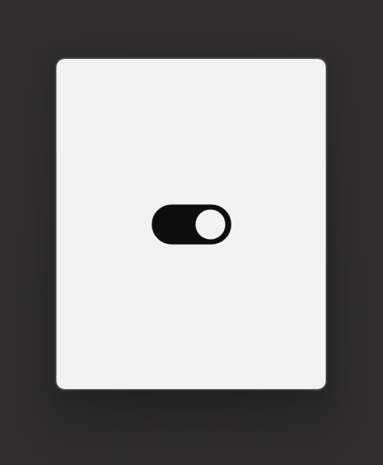

# Eto.Drawable_Toggle
A Toggle switch built from scratch using the Eto.Drawable Class

## Requirements ##
  - IronPython 2.7 on Rhino

## License ##
This project is licensed under the MIT License - see the [LICENSE](LICENSE) file for details.
